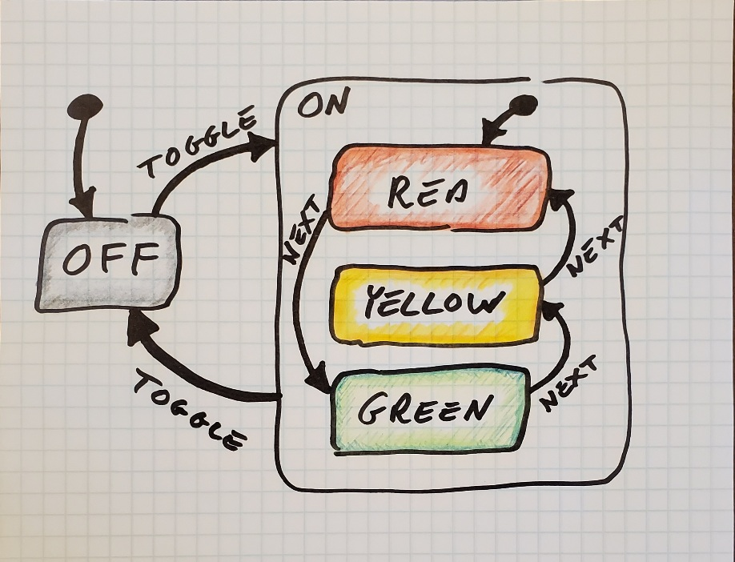

# StateChart
> statecharts with strong compile-time guarantees

[](https://github.com/jonathanchukinas/statechart/actions/workflows/elixir.yml)
[](https://hex.pm/packages/statechart)
[](https://hexdocs.pm/statechart)
[](LICENSE.md)

<!--- StateChart moduledoc start -->

A pure-Elixir implementation of statecharts inspired by

- David Harel's [Statecharts: a visual formalism for complex systems](https://www.sciencedirect.com/science/article/pii/0167642387900359) paper
- David Khourshid's JavaScript [XState](https://xstate.js.org/docs/) library

## Installation

This package can be installed by adding `statechart` to your list of dependencies in `mix.exs`:

```elixir
def deps do
  [
    {:statechart, "~> 0.3.0"}
  ]
end
```

## Concepts

We'll model a simple traffic light to illustrate some statechart concepts.



- This "machine" defaults to the `off` state (that's what the dot-arrow signifies).
- If we then send the machine a `TOGGLE` event, it transitions to the `on` state.
  From there, it automatically drops into the `red` state (again, because of the dot-arrow).
  At this point, the machine is in both the `on` and `red` states.
- If we send it a `NEXT` event, we transition to the `green` state (which you can also think of as the `on/green` state).
  Another `NEXT` event, and we transition to the `yellow` state.
  In this way, the light will just keep cycling through the colors.
- If we send it a `TOGGLE` at this point, it will transition back to `off`.
- If we now send the machine a `NEXT` event (while it's in the `off` state), nothing happens.

## Usage

There are three steps to modeling via the `Statechart` library:
- **DEFINE**
  - Start with a `statechart/2` block.
  - Define states with `state/3`. Nest as deeply as you want.
- **INSTANTIATE**
  - `MyStatechart.new/0`
- **MANIPULATE**
  - Send events via `trigger/2`.
  - Get current nested state via `states/1`.
  - `in_state?/2`
  - Get current context via `context/1`.
  - `last_event_status/1`

We'll model the above traffic light using these three steps.

### Define

```elixir
defmodule TrafficLight do
  use Statechart

  statechart default: :off do
    state :off, event: :TOGGLE >>> :on

    state :on, event: :TOGGLE >>> :off, default: :red do
      state :red,    event: :NEXT >>> :green
      state :yellow, event: :NEXT >>> :red
      state :green,  event: :NEXT >>> :yellow
    end
  end
end
```

### Instantiate

The module containing your statechart definition automatically has a `new/0` function injected into it.

```elixir
traffic_light = TrafficLight.new()
```

It returns you a [statechart](`t:t/0`) struct that you then pass to all the 'MANIPULATE' functions.

### Manipulate

The machine starts in the `off` state:
```elixir
[:off] = Statechart.states(traffic_light)
true   = Statechart.in_state?(traffic_light, :off)
false  = Statechart.in_state?(traffic_light, :on)
```

Send it a `NEXT` event without it being on yet:
```elixir
traffic_light = Statechart.trigger(traffic_light, :NEXT)
# Still off...
true = Statechart.in_state?(traffic_light, :off)
# ...but we can see that the last event wasn't valid:
:error = Statechart.last_event_status(traffic_light)
```

Let's turn it on:
```elixir
traffic_light = Statechart.trigger(traffic_light, :TOGGLE)
[:on, :red]   = Statechart.states(traffic_light)
true  = Statechart.in_state?(traffic_light, :on)
true  = Statechart.in_state?(traffic_light, :red)
false = Statechart.in_state?(traffic_light, :off)
false = Statechart.in_state?(traffic_light, :green)
```

**Now** the `NEXT` events will have an effect:
```elixir
traffic_light = Statechart.trigger(traffic_light, :NEXT)
[:on, :green] = Statechart.states(traffic_light)
```

## Error-checking

`Statechart` has robust compile-time checking.
For example, compiling this module will result in a `StatechartError`
at the `state :on` line.

```elixir
defmodule ToggleStatechart do
  use Statechart

  statechart default: :on do
    # Whoops! We've misspelled "off":
    state :on, event: :TOGGLE >>> :of
    state :off, event: :TOGGLE >>> :on
  end
end
```

<!-- warning: this is referenced by some Statechart function docs -->
## Events

Events trigger state changes.

Define events using the `:event` option in the following macros:
- `Statechart.state/3`
- `Statechart.statechart/2`
- `Statechart.subchart/1`

```elixir
defmodule ToggleStatechart do
  use Statechart
  statechart default: :on do
    state :on,  event: :TOGGLE >>> :off
    state :off, event: :TOGGLE >>> :on
  end
end
```

Note the `:EVENT_NAME >>> :target_state_name` construction.
This is just some syntactic sugar that returns `{:EVENT_NAME, :target_state_name}`,
so if you prefer to use the 2-tuple directly, free free to do so.

Use `Statechart.trigger/2` to send an event to a machine:

```
iex> toggle = ToggleStatechart.new()
iex> Statechart.states(toggle)
[:on]
iex> toggle = Statechart.trigger(toggle, :TOGGLE)
iex> Statechart.states(toggle)
[:off]
iex> toggle = Statechart.trigger(toggle, :TOGGLE)
iex> Statechart.states(toggle)
[:on]
```

<!-- warning: this is referenced by some Statechart function docs -->
## Actions

You can associate two types of actions (side effects) with each state:
- an `entry` action: performed _when entering_ the state, and
- an `exit` action: performed _when exiting_ the state.

Here is a Lightswitch that prints a message every time it exits and enters a new state:

    defmodule LightSwitch do
      use Statechart

      statechart default: :off do
        state :on,
          event: :TOGGLE >>> :off,
          entry: fn -> IO.puts("entering :on") end,
          exit: fn -> IO.puts("exiting :on") end
        end

        state :off,
          event :TOGGLE >>> :on,
          entry: fn -> IO.puts("entering :off") end,
          exit: fn -> IO.puts("exiting :off") end
        end
      end
    end

    lightswitch = LightSwitch.new
    # => "entering :off"

    Statechart.trigger(lightswitch, :TOGGLE)
    # => "exiting :off"
    # => "entering :on"

The actions above are all arity-0 functions that have side effects.
It's usually much more useful though to use arity-1 functions that modify a context:

### Context

First, let's clear up some confusion created by the word "state" in relation to state machines and statecharts.
Generally in computer science, "state" basically refers to anything that a process remembers or keeps track of.
For example, a clock knows what time it is and an object-oriented-programming "Person" object might know the first and last name of the person it represents.
Anything that has state is referred to as "stateful".

Basic state machines are stateful too. The state they keep track is (confusingly) called their "state".
For example, the above light switch "knows" whether it's in the `:on` state or the `:off` state.
This wouldn't be half so bad were it not for the fact that many state machines keep track of a second kind of state, which we call the "context".
The "context" is any data the state machine keeps track of in addition to its FSM-state.
For example, a smart lightswitch might keep track of how many times it's been cycled on and off.
A card game state machine might have a "drawing cards" state, and might have a context that tracks the cards each player has, whose turn it it, and which cards are in the draw and discard piles.

From now on, "state" will refer to the FSM-specific state (`:on`, `:off`, etc).

With all that out of the way, let's talk about the context.

Let's model that lightswitch that tracks how many cycles it's undergone.

    defmodule LightSwitch do
      use Statechart
      statechart default: :off,
                 context: {non_neg_integer, 0} do
        state :on,
          event: :OFF >>> :off,
          entry: &(&1 + 1)

        state :off,
          event: :ON >>> :on
      end
    end

In this example we see:
- The context type (`non_neg_integer()`) and initial value (`0`) declared using the `:context` option on `statechart/2`.
  When this statechart is instantiated, it will start with a context of `0`.
- Every time the switch is turned on, the context gets incremented by 1.
  This is because the `:on` state has a "entry action" of `&(&1 + 1)`.

### Multiple Actions

In statecharts where multiple actions are declared per state and/or where states are nested,
many actions might take place as a result of a single event.
In these cases, order matters.
Let's look at a contrived example.

    statechart default: :alpaca,
               event: :ALPHA >>> :beetle,
               context: {pos_integer, 1} do
      state :alpaca,
        entry: &(&1 + 1),
        entry: &(&1 * 3),
        exit: &(&1 - 2)

      state :beetle,
        entry: fn val -> val - 1 end
    end

The context is modified from its initial value of `1` to `6`.
Note the order of operations here.
The first action added one (`1 + 1 = 2`) and the second action multiplied by three (`2 * 3 = 6`).

When we trigger the `:ALPHA` event (`statechart = Statechart.trigger(statechart, :ALPHA)`),
we exit `:alpaca`, then enter `:beetle`, giving us a new context of `3`.
The first action (from exiting `:alpaca`) subtracted two (`6 - 2 = 4`).
The second action (from entering `:beetle`) subtracted one (`4 - 1 = 3`).

### Default Context

`:context` is an optional key for `statechart/2`.
If left out, the context type defaults to `t:term/0` and the value to `nil`.

<!-- warning: this is referenced by some Statechart function docs -->
## Defaults

One advantage statecharts have over FSMs is that they can have nested states.
Here is the [TrafficLight module](#module-define) from above.

```elixir
statechart module: TrafficLight, default: :off do
  state :off, event: :TOGGLE >>> :on

  state :on,
    default: :red,
    event: :TOGGLE >>> :off do
    state :red,    event: :NEXT >>> :green
    state :yellow, event: :NEXT >>> :red
    state :green,  event: :NEXT >>> :yellow
  end
end
```

You can be in the `red/on` state for example,
but you cannot be in the `on` state without also being in `red`, `yellow`, or `green`.
What this means for you, the developer, is that you can target a less-specific state (e.g. `on`),
as long as it is marked with a default,
so the statechart knows with more-specific state to "fall into".
This is why we added a `default: :red` options to the `:on` state.

Note that note every parent state requires a default, only those targeted by transitions.
Also, the root statechart needs a default (in our example, it has `default: :off`).

<!-- warning: this is referenced by some Statechart function docs -->
## Submodules

`statechart/2` accepts a `:module` option.
In the below example,
the module containing the statechart is `Toggle.Statechart`
```elixir
defmodule Toggle do
  use Statechart

  statechart module: Statechart do
    state :on,
      default: true,
      event: :TOGGLE >>> :off

    state :off,
      event: :TOGGLE >>> :on
  end
end
```

In this way, many statecharts may be declared easily in one file:

```elixir
defmodule MyApp.Statechart do
  use Statechart

  # module: MyApp.Statechart.Toggle
  statechart module: Toggle, default: :on do
    state :on, event: :TOGGLE >>> :off
    state :off, event: :TOGGLE >>> :on
  end

  # module: MyApp.Statechart.Switch
  statechart module: Switch, default: :on do
    state :on, event: :SWITCH_OFF >>> :off
    state :off, event: :SWITCH_ON >>> :on
  end
end
```

<!-- warning: this is referenced by some Statechart function docs -->
## Subcharts

Subcharts provide a mechanism for composing statecharts,
particularly useful for large, nested charts.
A subchart is analagous to template partials in web frameworks.

Here's how we can extract part the earlier TrafficLight statechart.

```elixir
defmodule ActiveTrafficLight do
  use Statechart
end

defmodule TrafficLight do
  use Statechart

  subchart module: Active, default: :red do
    state :red,    event: :NEXT >>> :green
    state :yellow, event: :NEXT >>> :red
    state :green,  event: :NEXT >>> :yellow
  end

  statechart default: :off do
    state :off, event: :TOGGLE >>> :on
    state :on,  event: :TOGGLE >>> :off, subchart: TrafficLight.Active
  end
end
```

## Other statechart / state machine libraries

With a plethora of other related libraries,
why did we need another one?
I wanted one that had very strict compile-time checks and a simple DSL.

Other libraries you might look into:
- [`Machinery`](https://hexdocs.pm/machinery/Machinery.html)
- [`as_fsm`](https://hexdocs.pm/as_fsm/readme.html)
- [`GenStateMachine`](https://hexdocs.pm/gen_state_machine/GenStateMachine.html)
- [`StateMachine`](https://hexdocs.pm/state_machine/StateMachine.html)
- [`gen_statem`](https://www.erlang.org/doc/man/gen_statem.html)
- [`fsm`](https://github.com/sasa1977/fsm)


## Roadmap

- [X] `v0.1.0` hierarchical states (see Harel, §2)
- [X] `v0.1.0` defaults (see Harel, Fig.6)
- [X] `v0.2.0` context and actions (see Harel, §5)
- [X] `v0.3.0` composability via subcharts
- [ ] actions associated with events (see γ/W in Harel, Fig.37)
- [ ] events triggered by actions (see β in Harel, Fig.37)
- [ ] orthogonality (see Harel, §3)
- [ ] event conditions
- [ ] final state
- [ ] state history (see Harel, Fig.10)
- [ ] transition history

<!--- StateChart moduledoc end -->

